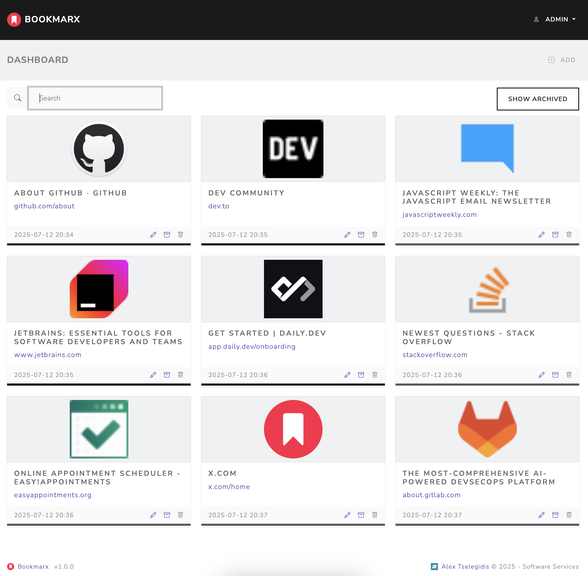

<h1 align="center">
    <br>
    <a href="https://bookmarx.org">
        
    </a>
    <br>
    Bookmarx
    <br>
</h1>

<br>

<h4 align="center">
    A simple Bookmark Manager App that can be installed on your server. 
</h4>

<p align="center">
  
  
  
</p>

<p align="center">
  <a href="#about">About</a> •
  <a href="#features">Features</a> •
  <a href="#setup">Setup</a> •
  <a href="#installation">Installation</a> •
  <a href="#license">License</a>
</p>



## About

**Bookmarx** is a bookmark manager application, designed for simplicity and efficiency. Everyone knows that running 
any software to production requires a lot of care so that everything works according to the plan. With Bookmarx you 
can spectate the current health state of your systems in real time.

## Features

The application will allow you to manage and organize your bookmark links.

## Setup

To clone and run this application, you'll need [Git](https://git-scm.com), [Node.js](https://nodejs.org/en/download/) (which comes with [npm](http://npmjs.com)) and [Composer](https://getcomposer.org) installed on your computer. From your command line:

```bash
# Clone this repository
$ git clone https://github.com/alextselegidis/bookmarx.git

# Go into the repository
$ cd bookmarx

# Install dependencies
$ npm install && composer install
```

Note: If you're using Linux Bash for Windows, [see this guide](https://www.howtogeek.com/261575/how-to-run-graphical-linux-desktop-applications-from-windows-10s-bash-shell/) or use `node` from the command prompt.

You can build the files by running `bash build.sh`. This command will bundle everything to a `build.zip` archive.

## Installation

You will need to perform the following steps to install the application on your server:

* Make sure that your server has Apache/Nginx, PHP (8.2+) and MySQL installed.
* Create a new database (or use an existing one).
* Copy the "bookmarx" source folder on your server.
* Make sure that the "storage" directory is writable.
* Rename the ".env.example" file to ".env" and update its contents based on your environment.
* Open the browser on the Bookmarx URL and follow the installation guide.

That's it! You can now use Bookmarx at your will.

You will find the latest release at [bookmarx.org](https://bookmarx.org).
You can also report problems on the [issues page](https://github.com/alextselegidis/bookmarx/issues)
and help the development progress.

## License

Code Licensed Under [GPL v3.0](https://www.gnu.org/licenses/gpl-3.0.en.html) | Content Under [CC BY 3.0](https://creativecommons.org/licenses/by/3.0/)

---

Website [alextselegidis.com](https://alextselegidis.com) &nbsp;&middot;&nbsp;
GitHub [alextselegidis](https://github.com/alextselegidis) &nbsp;&middot;&nbsp;
Twitter [@alextselegidis](https://twitter.com/AlexTselegidis)

###### More Projects On Github
###### ⇾ [Plainpad &middot; Self Hosted Note Taking App](https://github.com/alextselegidis/plainpad)
###### ⇾ [Easy!Appointments &middot; Online Appointment Scheduler](https://github.com/alextselegidis/easyappointments)
###### ⇾ [Integravy &middot; Service Orchestration At Your Fingertips](https://github.com/alextselegidis/integravy)
